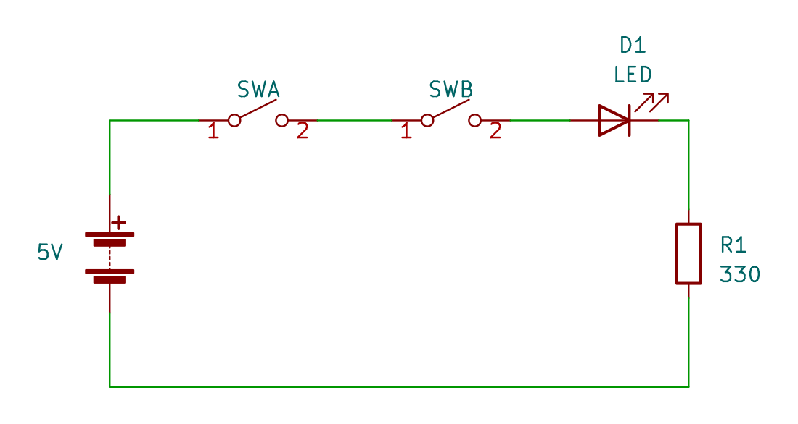
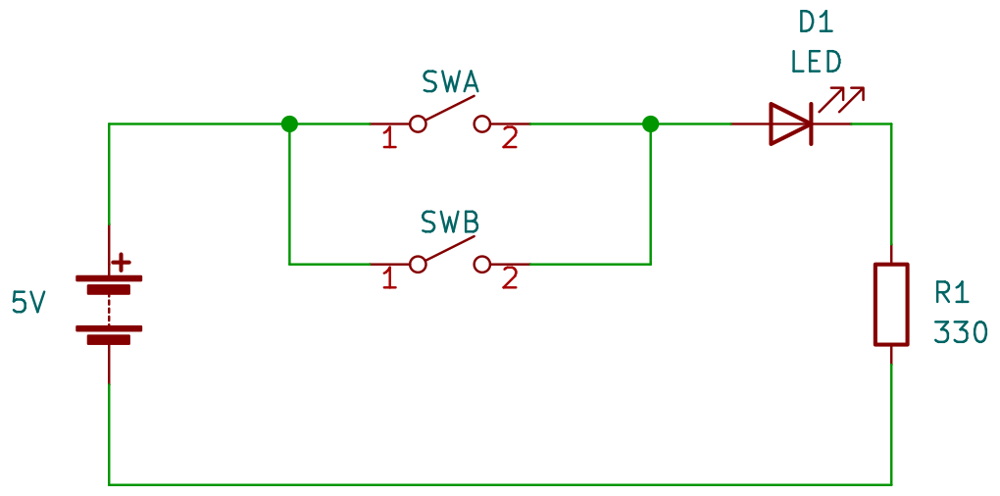

# Practica 1 - Generación de compuertas básicas con interruptores

Realizar las comprobaciones de las compuerta básicas AND, OR con interruptores.

## Compuerta AND

Las compuertas se pueden comprobar de manera eléctrica usando interruptores y con ello comprobar su tabla de verdad.

Siguiendo el siguiente circuito esquemático, armar en su protoboard.

Rellenar la siguiente tabla, con la palabra `encendido` o `apagado` en el estado del led, en función de la posición de los interruptores.

|SWA|SWB|ESTADO DEL LED|
|---|---|---|
|ABIERTO|ABIERTO||
|ABIERTO|CERRADO||
|CERRADO|ABIERTO||
|CERRADO|CERRADO||

## Compuerta OR

Las compuertas se pueden comprobar de manera eléctrica usando interruptores y con ello comprobar su tabla de verdad.

Siguiendo el siguiente circuito esquemático, armar en su protoboard.

Rellenar la siguiente tabla, con la palabra `encendido` o `apagado` en el estado del led, en función de la posición de los interruptores.

|SWA|SWB|ESTADO DEL LED|
|---|---|---|
|ABIERTO|ABIERTO||
|ABIERTO|CERRADO||
|CERRADO|ABIERTO||
|CERRADO|CERRADO||

## Pensamiento critico

- Dar 6 ejemplos de como aplicarías estas configuraciones interruptores en alguna parte de tu casa, escuela, etc. Haciendo uso de estos interruptores para el control de algo. (3 ejemplos con OR y 3 con AND)

---

> Circuitos digitales

> Mecatrónica

---