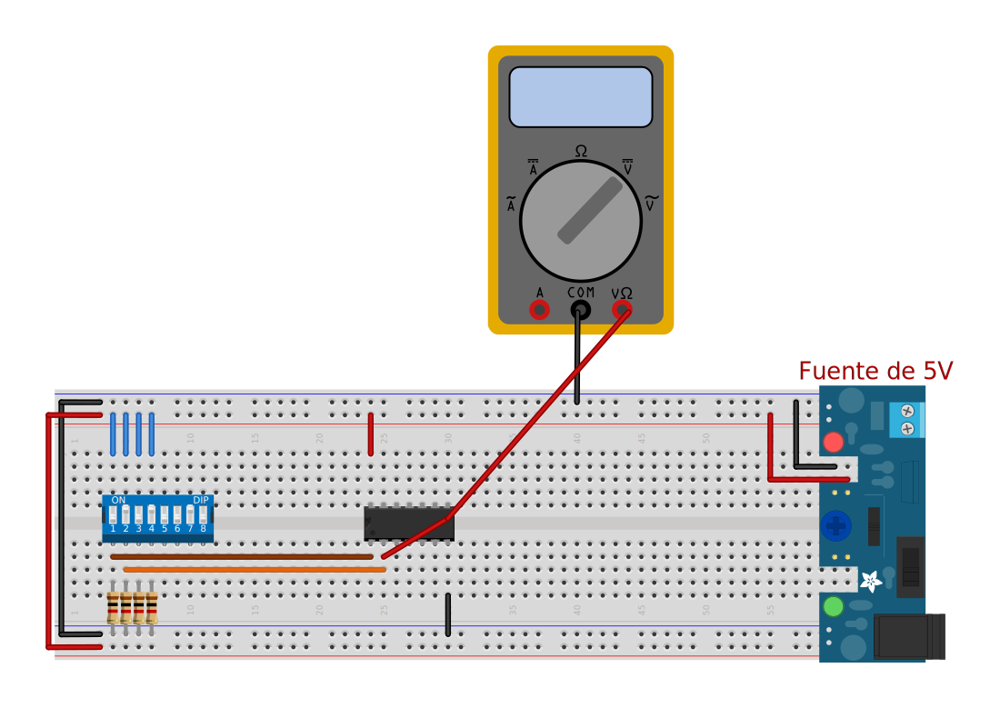

# Practica 2 - Comprobación de compuertas y niveles lógicos

## Objetivo

En esta practica a prenderás a identificar las compuerta lógicas, en sus entradas, salidas, pines de alimentación, niveles de voltaje, y saber si tienes un 1 o un 0 lógico.

## Materiales

|Cantidad|Nombre|Descripción|
|---|---|---|
|1|Multímetro|Voltímetro|
|1|IC 7404|Compuerta |
|1|IC 7408|Compuerta |
|1|IC7432|Compuerta |
|1|Led||
|1|Resistencias 330||
|2|Resistencias 1k||
|1|Dipswitch o push button||
|1|Datasheet|Hoja de datos del 7404|
|1|Datasheet|Hoja de datos del 7408|
|1|Datasheet|Hoja de datos del 7432|

## Desarrollo

### Paso 1: Identificación de salidas digitales

Para realizar la identificación de entradas y salidas se debe tomar el datasheet de cada compuerta. En su hoja de especificaciones vamos observar la distribución de pines

### Paso 2: Probar niveles de voltaje de entrada

Montar el circuito integrado en el protoboard y darle alimentación (voltaje). Realizando la siguiente conexión:

!!! danger
    Las compuertas soportan máximo 6V (Revisar datasheet), si se pasa de ese voltaje quemaras el IC.

!!! note
    Si cuentas con una pila de 9V, utilizar un regulador de voltaje 7805

Una vez realizada las conexiones realizar las combinaciones en la entrada (en el dipswitch) para cada compuerta que tenga el IC.

Primero revisaras los valores de entrada, que serian la entrada **A** y **B**

### Paso 3: Verificar niveles de voltaje de Salida

Ahora vamos a realizar las combinaciones en la entrada y ver los voltajes que tenemos a la salida de cada compuerta.

**AND 7408**

|A|B|Voltaje de salida|
|---|---|---|
|0|0||
|0|1||
|1|0||
|1|1||

**OR 7432**

|A|B|Voltaje de salida|
|---|---|---|
|0|0||
|0|1||
|1|0||
|1|1||

**NOT 7404**

|A|Voltaje de salida|
|---|---|
|0||
|1||

### Paso 4: Verificación de salida con LED

Ahora vas a colocar un led a la salida de cada compuerta que contenga el IC, realizando las combinaciones de la tabla de verdad y ver lo que sucede con el estado del LED

**AND 7408**

|A|B|ESTADO LED|
|---|---|---|
|0|0||
|0|1||
|1|0||
|1|1||

**OR 7432**

|A|B|ESTADO LED|
|---|---|---|
|0|0||
|0|1||
|1|0||
|1|1||

**NOT 7404**

|A|ESTADO LED|
|---|---|
|0||
|1||

---

## Resultado

    

---

> Circuitos digitales

> Mecatrónica

---