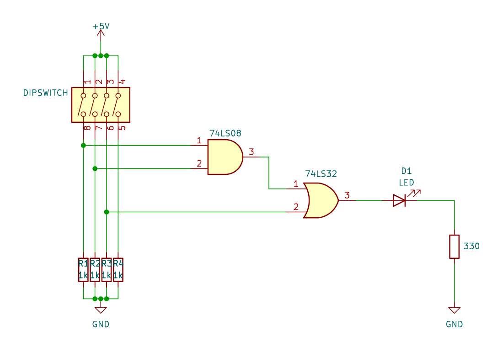
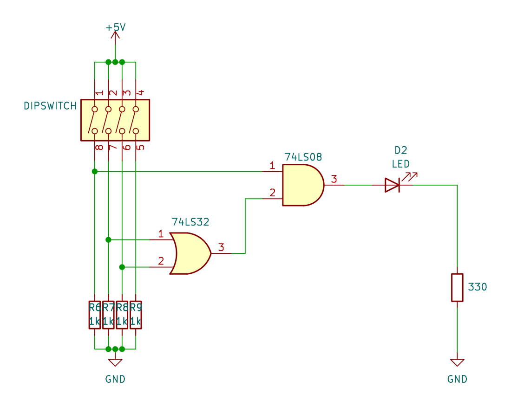
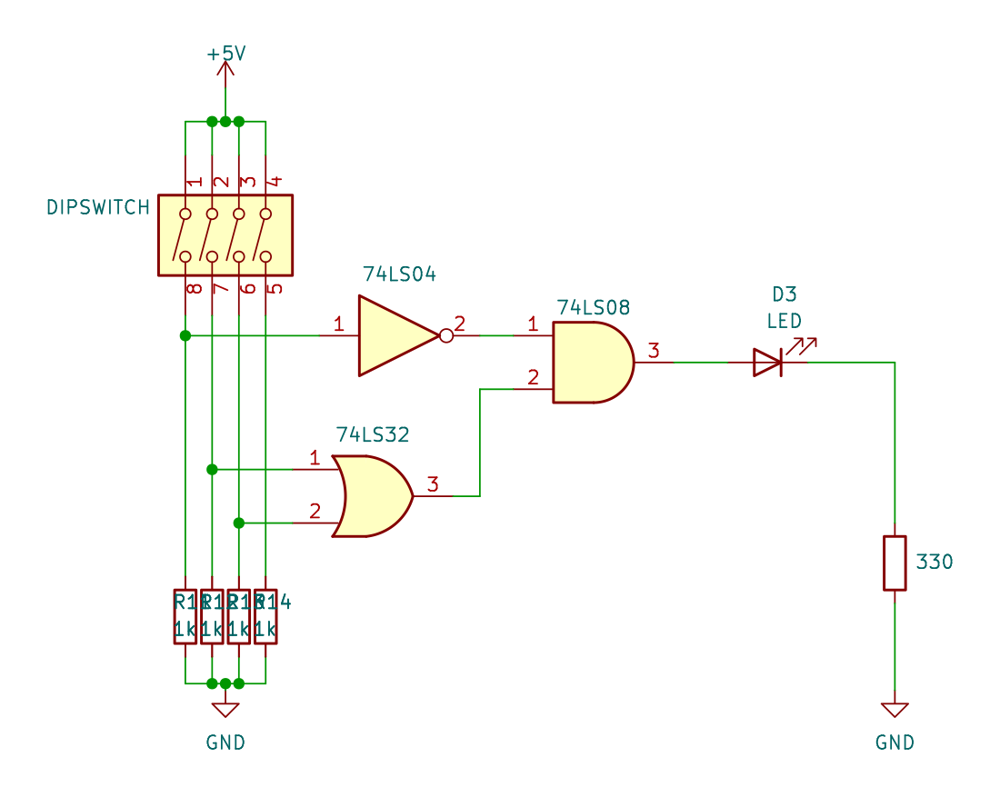
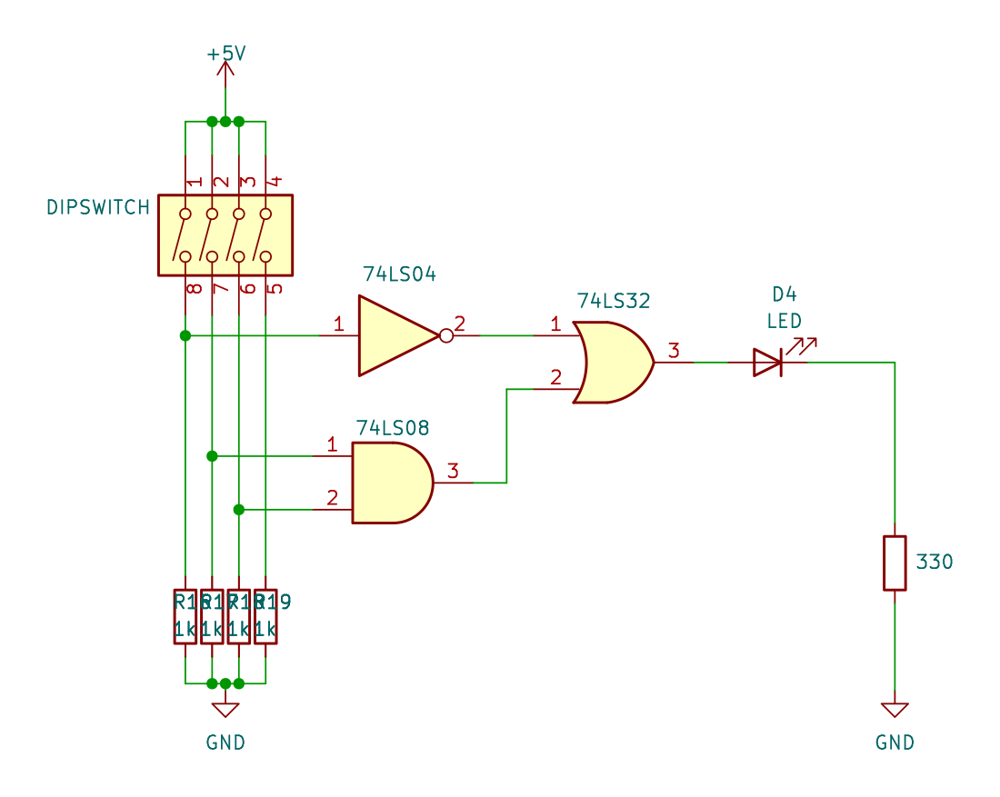

# Practica 3 - Circuitos digitales básicos

## Objetivo

Construir y analizar el comportamiento de circuitos digitales, creando tablas de verdad.

## Materiales

|Cantidad|Nombre|Descripción|
|---|---|---|
|1|Multímetro|Voltímetro|
|1|IC 7404|Compuerta |
|1|IC 7408|Compuerta |
|1|IC7432|Compuerta |
|1|Led||
|1|Resistencias 330||
|2|Resistencias 1k||
|1|Dipswitch o push button||

## Desarrollo

### Paso 1: Circuito 1

Construir el siguiente circuito y llenar la tabla de verdad correspondiente.

Llena la siguiente tabla:

|A|B|C|Salida|
|---|---|---|---|
|0|0|0||
|0|0|1||
|0|1|0||
|0|1|1||
|1|0|0||
|1|0|1||
|1|1|0||
|1|1|1||

### Paso 2: Circuito 2

Construir el siguiente circuito y llenar la tabla de verdad correspondiente.

Llena la siguiente tabla:

|A|B|C|Salida|
|---|---|---|---|
|0|0|0||
|0|0|1||
|0|1|0||
|0|1|1||
|1|0|0||
|1|0|1||
|1|1|0||
|1|1|1||

### Paso 3: Circuito 3

Construir el siguiente circuito y llenar la tabla de verdad correspondiente.

Llena la siguiente tabla:

|A|B|C|Salida|
|---|---|---|---|
|0|0|0||
|0|0|1||
|0|1|0||
|0|1|1||
|1|0|0||
|1|0|1||
|1|1|0||
|1|1|1||

### Paso 4: Circuito 4

Construir el siguiente circuito y llenar la tabla de verdad correspondiente.

Llena la siguiente tabla:

|A|B|C|Salida|
|---|---|---|---|
|0|0|0||
|0|0|1||
|0|1|0||
|0|1|1||
|1|0|0||
|1|0|1||
|1|1|0||
|1|1|1||

---

> Circuitos digitales

> Mecatrónica

---