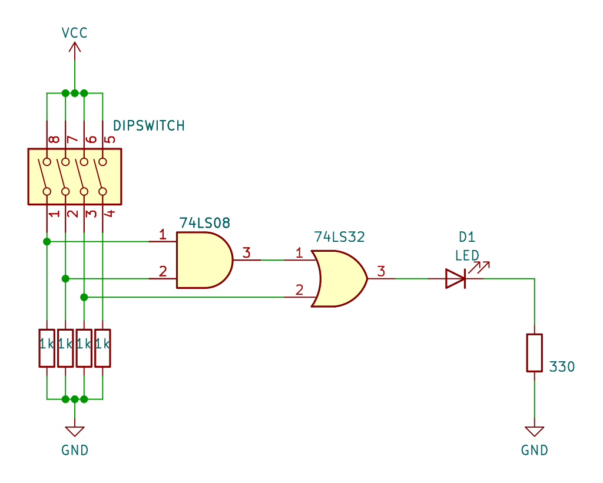
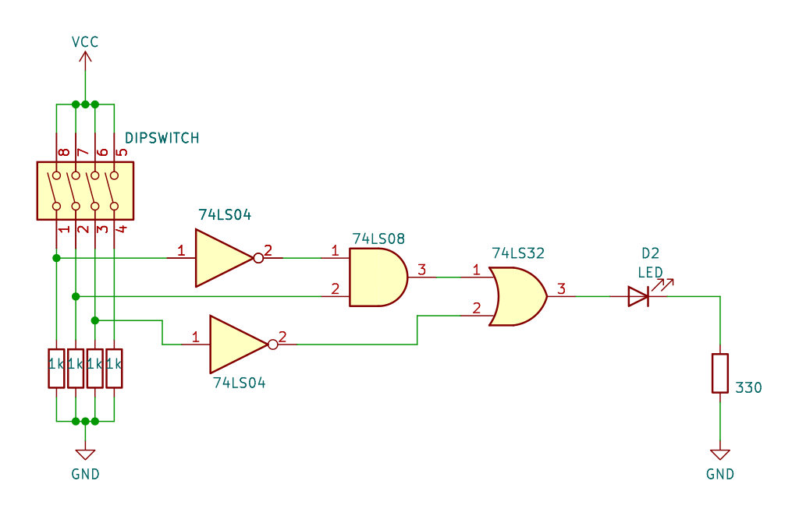

# Practica 5 - Álgebra booleana básico

## Objetivo

Construir y analizar el comportamiento de circuitos digitales, creando tablas de verdad.

## Materiales

|Cantidad|Nombre|Descripción|
|---|---|---|
|1|Multímetro|Voltímetro|
|1|IC 7404|Compuerta |
|1|IC 7408|Compuerta |
|1|IC7432|Compuerta |
|x|Leds||
|x|Resistencias 330||
|x|Resistencias 1k||
|1|Dipswitch o push button||

## Desarrollo

### Paso 1: Circuito digital 

Realizar el siguiente circuito, generar la tabla de verdad y su ecuación

### Paso 2: Circuito digital 

Realizar el siguiente circuito, generar la tabla de verdad y su ecuación

---

> Circuitos digitales

> Mecatrónica

---